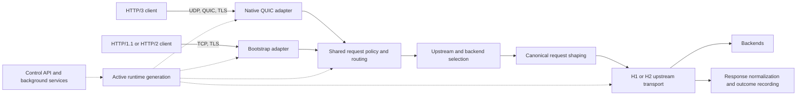

# Architecture Overview

Impulse is an HTTP/3-first edge runtime. A native QUIC listener accepts HTTP/3
over UDP, while a bootstrap listener on the same configured address and port
accepts HTTP/1.1 and HTTP/2 over TCP/TLS. Both ingress adapters use the same
runtime generation, policy, routing, backend-selection, transport, and outcome
contracts.

## Architecture Pages

| Question | Page |
| --- | --- |
| How is the system divided and which crate owns each boundary? | This page |
| What happens to one request? | [Request Lifecycle](/docs/architecture/request-lifecycle) |
| How does configuration become active runtime state? | [Runtime Generation and Configuration Lifecycle](/docs/architecture/runtime-generation) |
| How are H1/H2 upstream execution and backend state managed? | [Transport and Backend Lifecycle](/docs/architecture/transport-and-backend-lifecycle) |

## System Shape

The data plane accepts, evaluates, routes, and forwards requests. The control
plane validates and activates configuration, exposes runtime state and metrics,
runs health/DNS/certificate work, and coordinates drain or restart behavior.
Control-plane services read the same active generation as request workers.

## Native QUIC and Bootstrap Boundaries

| Concern | Native QUIC listener | Bootstrap listener |
| --- | --- | --- |
| Downstream wire protocol | HTTP/3 over QUIC on UDP | HTTP/1.1 or HTTP/2 over TCP/TLS |
| Ingress ownership | QUIC handshake, connection IDs, packets, H3 streams | TCP/TLS accept, Hyper request intake, compatibility parsing |
| Request policy | Shared | Shared |
| Routing and backend selection | Shared | Shared |
| Upstream transport | Shared H1/H2 façade | Shared H1/H2 façade |
| Response egress | H3 stream writes | HTTP/1.1 or HTTP/2 response writes |
| Upgrade behavior | No HTTP/1.1-style upgrade semantics | HTTP/1.1 WebSocket/upgrade handling where supported |

The bootstrap listener is a compatibility adapter, not a second policy engine.
Protocol-specific parsing, connection management, and response writeback remain
local to each adapter; policy meaning and backend execution should not diverge.

## Workspace Ownership

The current Rust workspace contains these crates:

| Crate | Path | Architectural responsibility |
| --- | --- | --- |
| `impulse` | `impulse/` | CLI, startup sequencing, listener-group supervision, signals, drain, and process exit |
| `impulse-config` | `crates/config/` | YAML model, parsing, validation, secret resolution, and normalized runtime configuration |
| `impulse-edge` | `crates/edge/` | Ingress adapters, request orchestration, routing, admission, resilience, runtime generations, backend lifecycle, metrics, and watchdog |
| `impulse-bridge` | `crates/bridge/` | Canonical upstream request construction, header policy, response normalization, and upgrade helpers |
| `impulse-transport` | `crates/transport/` | Runtime-selected HTTP/1.1 or HTTP/2 backend execution, connection reuse, timeouts, DNS-aware connection establishment, and client rotation |
| `impulse-lb` | `crates/lb/` | Balancing algorithms, upstream pool selection, health flags, and per-pool request accounting |
| `impulse-utils` | `crates/utils/` | Shared TLS and logging utilities |
| `impulse-errors` | `crates/errors/` | Cross-crate error and retry/hedge classification types |

Crate boundaries are intentional: `edge` decides whether and where to send a
request; `bridge` shapes it; `transport` decides how to execute it; `lb`
provides selection and accounting primitives.

## Edge Runtime Boundaries

Within `impulse-edge`:

- `quic_listener` owns native and bootstrap adapter mechanics, worker wiring,
  forwarding orchestration, and control-service integration.
- `request_pipeline` provides protocol-neutral route and selected-policy
  contracts used by both adapters.
- `routing` owns the route index and matching decisions.
- `resilience` and `quic_listener::admission` own admission and protection
  policy.
- `runtime` owns published generations, request state/guardrails/outcomes,
  backend lifecycle, TLS inventory, shared services, and task ownership.
- `metrics`, `observability`, and `watchdog` own their process-wide operational
  contracts.

Listener code may orchestrate these services, but should not reimplement their
policy or durable state.

## State and Concurrency

The binary starts one managed listener group per configured listener. Native
QUIC workers use UDP sockets and may use packet shards; bootstrap accepts TCP
traffic for the same listener identity. Backend I/O and control work run on
Tokio runtimes.

Workers read an immutable `RuntimeBundle` through `RuntimeBundleHandle`. A
successful activation publishes a whole new bundle; readers holding the prior
bundle can finish without observing a partially updated configuration. Backend
and process services have explicit generation or process ownership described in
[Runtime Generation and Configuration Lifecycle](/docs/architecture/runtime-generation).

## Architectural Rules

- Keep ingress-specific wire mechanics in the native or bootstrap adapter.
- Keep request policy and outcome meaning shared across both adapters.
- Do not infer upstream protocol in `edge`; consume normalized config and the
  transport façade.
- Do not let transport own routing, admission, retries, or durable health state.
- Do not reconstruct active state from listener-local fields; read the active
  runtime generation.
- Keep exact configuration and endpoint contracts in their reference pages,
  not in architecture prose.

## Related Pages

- [Configuration Reference](/docs/configuration/reference)
- [Control API Reference](/docs/reference/control-api-reference)
- [Codebase Map](/docs/development/codebase-map)
- [Development Invariants](/docs/development/invariants)
