# Request Lifecycle

This page describes the current request path shared by the native QUIC and
bootstrap ingress adapters. It focuses on decision ownership rather than wire
or source-level detail.

## Flow

```mermaid
flowchart LR
    intake["Ingress intake and validation"] --> route["Route resolution"]
    route --> select["Backend selection"]
    select --> preauth["Selected policy and pre-auth admission"]
    preauth --> auth["External auth when configured"]
    auth --> postauth["Post-auth admission"]
    postauth --> build["Canonical request build"]
    build --> execute["Transport execution, retry, hedge"]
    execute --> normalize["Response normalization and guardrails"]
    normalize --> writeback["Protocol-specific writeback"]
    writeback --> outcome["Outcome and backend feedback"]
```

Route and backend resolution happen before route-scoped policy evaluation so
Impulse knows which upstream policy, pool, and bounded observability identity
apply. A locally rejected request does not proceed to backend dispatch; any
selection accounting is finalized by the outcome path.

## Ownership at a Glance

| Concern | Owner | Boundary |
| --- | --- | --- |
| Downstream parsing and wire validation | `impulse-edge::quic_listener` native or bootstrap adapter | Produces normalized method, path, authority, headers, body mode, peer identity, and timing context |
| Shared protocol limits and body guardrails | `impulse-edge::runtime::connection` and resilience policy | Returns typed allow, reject, timeout, and size-limit decisions; adapters serialize them |
| Route resolution | `impulse-edge::request_pipeline` over `edge::routing` | Matches method, path, and authority to one upstream |
| Backend selection | Edge forwarding service using `impulse-lb` pools | Selects an eligible backend and starts per-pool accounting |
| Admission and authentication | `quic_listener::admission`, `edge::resilience`, and shared request-policy services | Evaluates local auth, rate limits, brownout, external auth, quota, and inflight protection in their defined phases |
| Request construction and response normalization | `impulse-bridge` | Applies host/forwarded-header policy and hides protocol-specific H1/H2 request builders |
| Retry and hedge orchestration | `impulse-edge` forwarding | Decides whether another attempt is allowed and selects an alternate backend |
| Backend protocol execution | `impulse-transport` | Executes the chosen backend as HTTP/1.1 or HTTP/2 behind one façade |
| Terminal outcome and backend feedback | `impulse-edge::runtime::connection::outcome` with adapter observation glue | Records canonical route/backend results and applies typed lifecycle feedback |

## 1. Ingress Intake and Validation

The native adapter owns UDP, QUIC/TLS, HTTP/3 connection and stream state. The
bootstrap adapter owns TCP/TLS, HTTP/1.1 or HTTP/2 request intake, and
HTTP/1.1-specific upgrade detection.

Each adapter validates its wire contract and produces the HTTP semantics needed
by shared services. Connection, stream, and Hyper objects remain adapter-local;
they are not shared request-policy types.

## 2. Route Resolution and Backend Selection

The shared route service matches the validated method, path, and authority
against the active generation's route index. It returns the upstream identity
and match metadata. Edge forwarding then asks the upstream pool to select an
eligible backend using the configured balancing strategy and request-key input.

`impulse-lb` owns algorithms, eligibility flags, and pool accounting. It does
not own request parsing, routing precedence, auth, or transport execution.

## 3. Selected Policy and Admission

The chosen upstream supplies the request policy. Pre-auth admission evaluates
local API-key/JWT policy, brownout, and scoped rate limiting. External
authorization runs next when configured. Post-auth admission applies quota,
route/global/upstream/backend inflight protection, queueing, circuit state, and
adaptive admission as applicable.

Admission services return typed decisions. Native and bootstrap adapters retain
only response serialization and protocol lifecycle duties; they should not
invent different policy semantics.

## 4. Canonical Upstream Request

After admission, `impulse-bridge` builds the upstream request for the selected
backend transport. It owns:

- host-policy and forwarded-header application
- auth-approved header mutations
- hop-by-hop request-header filtering
- body-mode shaping
- HTTP/1.1 upgrade request shaping
- the internal H1 and H2 request builders

Edge supplies the normalized request, selected endpoint, and resolved policy;
it does not duplicate header construction.

## 5. Dispatch, Retry, and Hedge

Edge owns per-attempt orchestration: inflight permits, circuit state, retry
budget, hedge eligibility, alternate selection, and request deadlines. Each
attempt is handed to `UpstreamTransportPool` as a backend identity plus a
canonical request.

Transport applies its connection and execution behavior and returns a canonical
response or error. Shared classification maps that result to retryability,
health feedback, and stable observability reasons; transport does not decide
request policy.

## 6. Response and Streaming

`impulse-bridge::response` filters hop-by-hop headers and trailers and decides
bodyless/no-content emission policy. Shared connection guardrails enforce body
size, prebuffer, idle, and total-streaming limits.

The adapters then diverge only for writeback:

- native QUIC emits headers, chunks, trailers, and terminal state on the H3
  stream
- bootstrap returns an HTTP/1.1 or HTTP/2 response and handles an accepted
  HTTP/1.1 upgrade tunnel where applicable

## 7. Outcome Recording

Every terminal path—success, upstream failure, timeout, local rejection,
overload, client disconnect, or response abort—must finalize through shared
outcome semantics. The outcome layer owns route/backend metrics, pool request
accounting, passive health feedback, retry/hedge telemetry, and canonical
reason mapping.

Adapters provide protocol-specific facts but must not independently redefine
what the terminal result means.

## Invariants

- Equivalent native and bootstrap requests receive the same route and policy
  decision unless the downstream protocol itself requires different behavior.
- A route resolves to an upstream before that upstream's policy is evaluated.
- Backend selection and transport execution remain separate decisions.
- Only explicit `http://` backends use upstream HTTP/1.1; HTTPS and schemeless
  backends use upstream HTTP/2 over TLS.
- Every terminal path records an outcome once and releases its accounting and
  admission state.

## Related Pages

- [Architecture Overview](/docs/architecture/overview)
- [Transport and Backend Lifecycle](/docs/architecture/transport-and-backend-lifecycle)
- [Runtime Generation and Configuration Lifecycle](/docs/architecture/runtime-generation)
- [Routing and Upstreams](/docs/configuration/routing-and-upstreams)
