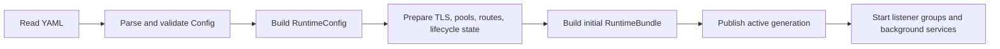

# Runtime Generation and Configuration Lifecycle

Impulse converts YAML into a validated, normalized runtime generation. Request
workers and control-plane readers consume that generation as one coherent
snapshot; live activation replaces the snapshot rather than mutating unrelated
subsystems piecemeal.

## Ownership

| Layer | Responsibility |
| --- | --- |
| `impulse-config` | Parse YAML, validate the public schema, resolve bounded file/secret inputs, and create `RuntimeConfig` with normalized listener, upstream, backend, and policy values |
| `impulse` binary | Choose the config path, run startup validation, build the first runtime, start listener groups and control services, supervise topology, and coordinate drain/shutdown |
| `impulse-edge::runtime` | Assemble bundles, classify ownership, plan activation, publish generations, retain history, roll back, and own generation-scoped tasks |
| Control API adapter | Authenticate/authorize requests, parse candidates, invoke the activation service, and serialize/audit results |

Configuration validity and live-reload compatibility are different checks. A
candidate can satisfy the schema but still require restart, conflict with the
active generation, fail resource preparation, or be rejected after drain has
started.

## State Classes

| Class | Lifetime | Current examples |
| --- | --- | --- |
| Startup-owned | Fixed for the process; incompatible changes are rejected for live activation | Config path and logging sink/format settings; `log.level` is handled as a live exception |
| Generation-owned | Rebuilt and replaced by activation | Listener runtime configs, route index, upstream policies and pools, backend maps and health-check definitions, inflight semaphores, resilience state, and generation task registry |
| Process-scoped services | Carried across swaps when continuity matters | Listener TLS reload store, watchdog coordinator, and shared DNS resolver/cache |
| Config-derived shared services | Rebuilt for the candidate generation | Transport pool, metrics view, backend lifecycle coordinator, and backend resolution store |

`RuntimeBundle` packages the generation number, startup-owned state, normalized
runtime config, shared services, and generation-owned state. `RuntimeBundleHandle`
publishes the active bundle and owns lifecycle gating and retained history.

## Startup Lifecycle

An explicit missing, unreadable, malformed, or invalid config exits startup.
A valid config does not exit successfully after validation; it proceeds to
runtime preparation and listener startup.

Startup validation is owned by `impulse-config::validator`; runtime
interpretation is owned by `impulse-config::runtime`; construction of edge
services and the bundle is owned by `impulse-edge`.

## Staged Activation Lifecycle

The safe Control API workflow is `validate → preview → activate`:

1. `validate` parses the candidate, validates schema and semantics, normalizes
   runtime values, performs required preflight/resource checks, and reports
   rejected changes. It does not publish the candidate.
2. `preview` runs the same staging path and returns the proposed generation and
   diff classification. It also does not mutate the active generation.
3. `activate` stages again, verifies `expected_generation` when supplied,
   rechecks lifecycle and compatibility gates, starts candidate generation
   tasks, and commits the prepared bundle.
4. `RuntimeBundleHandle` swaps one complete `Arc<RuntimeBundle>`, archives the
   previous generation, updates history/metrics, and retires the previous
   generation's task registry.
5. Listener-group supervision reconciles active listener topology against the
   newly published generation.

Failures before the swap leave the current generation active. Activation is
rejected during drain or shutdown. Use the
[Control API Reference](/docs/reference/control-api-reference) for endpoint,
payload, concurrency, and status-code contracts.

## Read Semantics

Workers and operator surfaces ask the handle for an active generation view.
They do not assemble current state from separate listener fields. A reader that
already holds the previous bundle may finish against that immutable snapshot;
new reads observe the newly published bundle.

This gives each request a coherent route/policy/backend view and keeps runtime
snapshots, metrics rendering, and control operations aligned with the same
generation identity.

## Rollback

Rollback selects a retained rollback candidate, prepares fresh shared services
from its stored normalized config while carrying required process-scoped
services, and publishes the result as a new active generation. It is not an
in-place mutation and does not decrement the generation counter.

Rollback is subject to the same expected-generation, preparation,
compatibility, and lifecycle gates as activation. Retained history is bounded;
operators must not assume every historical generation remains a rollback
candidate indefinitely.

## Background Task Ownership

Generation-specific refresh and policy work belongs to that generation's
`RuntimeTaskRegistry`. Swapping the bundle retires the old registry in one
place. Process-scoped services survive when resetting them would lose live
watchdog, TLS-reload, or DNS-cache state.

This distinction prevents old-generation tasks from continuing to mutate state
after activation while allowing in-flight readers to finish safely.

## Change Boundaries

Architecture does not maintain a second field-by-field reload matrix. Use:

- [Configuration Reference](/docs/configuration/reference) for schema meaning
- [Control API Reference](/docs/reference/control-api-reference) for staged operations
- [Reload and Drain](/docs/operations/reload-and-drain) for operator workflow
- [Production Rollout and Validation](/docs/deployment/production#rollout-and-validation) for safe validation procedures

## Invariants

- Validation and preview never publish a generation.
- Activation publishes a complete prepared bundle or leaves the active bundle
  unchanged.
- Startup-owned changes cannot silently enter through a live swap.
- A stale `expected_generation` fails instead of overwriting concurrent work.
- Generation tasks retire with their generation.
- Activation cannot commit after drain or shutdown begins.

## Related Pages

- [Architecture Overview](/docs/architecture/overview)
- [Request Lifecycle](/docs/architecture/request-lifecycle)
- [Transport and Backend Lifecycle](/docs/architecture/transport-and-backend-lifecycle)
