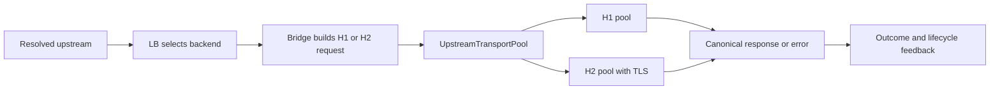

# Transport and Backend Lifecycle

This page joins two adjacent but separate concerns: how a selected backend is
used for one request, and how that backend's resolution, health, membership,
and clients evolve over time.

## Backend Protocol Behavior

`impulse-config` normalizes each backend address into an endpoint and transport
kind:

| Configured backend address | Normalized upstream behavior |
| --- | --- |
| `http://host[:port]` | Cleartext HTTP/1.1; default port `80` |
| `https://host[:port]` | HTTP/2 over TLS; default port `443` |
| `host:port` or a schemeless hostname | HTTP/2 over TLS; HTTPS is the default |

Backend addresses cannot contain a path, query, or fragment. HTTPS certificate
verification is enabled by default and may use configured trust roots and an
upstream client identity. Impulse does not forward to backends over
HTTP/3.

## Responsibility Split

| Concern | Owner |
| --- | --- |
| Parse and normalize endpoint scheme, authority, port, and transport kind | `impulse-config` |
| Match a request to an upstream | `impulse-edge::routing` through the shared request pipeline |
| Select an eligible backend and maintain pool accounting | `impulse-lb` with edge forwarding orchestration |
| Build the protocol-appropriate upstream request and normalize its response | `impulse-bridge` |
| Execute HTTP/1.1 or HTTP/2, reuse connections, apply transport timeouts, and rotate clients | `impulse-transport` |
| Coordinate resolution, health, membership, request feedback, and operator snapshots | `impulse-edge::runtime::backend` |
| Schedule active checks and Domain Name System (DNS) refresh work | `impulse-edge::quic_listener` control/background services |

Selection does not choose the wire implementation. It returns a backend;
transport consumes the normalized transport kind for that backend.

## Transport Boundary

`UpstreamTransportPool` is the canonical façade. Edge supplies a backend
identity and canonical request; the pool dispatches internally to its H1 or H2
client pool.

Transport owns:

- protocol-specific connection creation and reuse
- per-backend inflight and idle-client behavior configured for transport
- connect and execution timeouts
- DNS-aware connection establishment
- backend-client rotation after effective address changes
- mapping protocol/pool failures into transport-facing errors
- HTTP/1.1 upgrade execution for a compatible bootstrap tunnel

Edge retains request deadlines, admission, circuit/retry/hedge decisions,
alternate backend selection, body streaming guardrails, downstream writeback,
and terminal outcome meaning.

## Execution Flow

H1 and H2 are intentionally not identical internally. Their connection and
pool differences remain behind the façade so native and bootstrap forwarding
do not branch on protocol mechanics.

## Backend Lifecycle Model

The lifecycle coordinator maintains one operator-visible model assembled from:

| State | Meaning |
| --- | --- |
| Identity | Stable backend key based on the configured backend address string |
| Resolution | Authority host/port, address kind, resolved socket addresses, last successful refresh, and refresh generation |
| Health | Unknown, healthy, or unhealthy with a canonical reason |
| Membership | Active, suppressed, or removed placement state |
| Placement | Upstream pools that contain the backend and their pool-local state |

`impulse-lb` still owns pool-local eligibility and accounting. The edge
lifecycle layer owns typed events, transitions, merged inventory, and snapshots
used by the Control API and observability surfaces.

## DNS Refresh and Client Rotation

Hostname backends use the shared DNS resolver and lifecycle store:

1. A refresh resolves the configured authority.
2. Lifecycle classifies the result as changed, unchanged, empty, or failed.
3. Successful changed addresses update resolution state and request transport
   client rotation.
4. Empty or failed refreshes preserve the last usable address set rather than
   erasing it.
5. Rotation success or failure is recorded independently from DNS success.

The resolver/cache is process-scoped and survives generation activation;
candidate backend definitions, transport pools, and lifecycle views are rebuilt
for the active generation.

## Health and Request Feedback

Active checks and passive request outcomes enter lifecycle as typed
observations. Lifecycle decides the transition and keeps pool health and the
canonical snapshot aligned.

Request completion carries backend identity, elapsed time, optional status,
and a success/neutral/failure classification. Outcome recording applies pool
accounting once and forwards health-relevant feedback. Transport reports what
happened on the wire; it does not directly own durable health transitions.

Health, resolution, and membership are distinct. A backend may retain resolved
addresses while unhealthy, or remain known while suppressed/removed from a
pool. Operator views must not infer one state from another.

## Runtime Generation Interaction

A generation owns upstream definitions, endpoint maps, health-check
definitions, pools, and the transport/lifecycle topology built from them.
Activation publishes those pieces coherently. Process-scoped DNS cache and
other deliberately carried services survive the swap.

Old requests may finish with the old generation they already hold. New requests
use the new generation's route, pool, transport, and lifecycle view. See
[Runtime Generation and Configuration Lifecycle](/docs/architecture/runtime-generation)
for the swap contract.

## Invariants

- Explicit `http://` means cleartext upstream HTTP/1.1.
- HTTPS and schemeless endpoints mean upstream HTTP/2 over TLS.
- Routing selects an upstream; load balancing selects a backend; transport
  realizes that backend's normalized protocol.
- DNS failure does not discard the last usable address set.
- Client rotation and DNS refresh have separate outcomes.
- Request paths emit feedback; lifecycle owns durable backend-state changes.
- Control API views consume canonical lifecycle snapshots rather than joining
  listener-local stores ad hoc.

## Related Pages

- [Architecture Overview](/docs/architecture/overview)
- [Request Lifecycle](/docs/architecture/request-lifecycle)
- [Routing and Upstreams](/docs/configuration/routing-and-upstreams)
- [TLS Configuration](/docs/configuration/tls)
- [Control API Reference](/docs/reference/control-api-reference)
